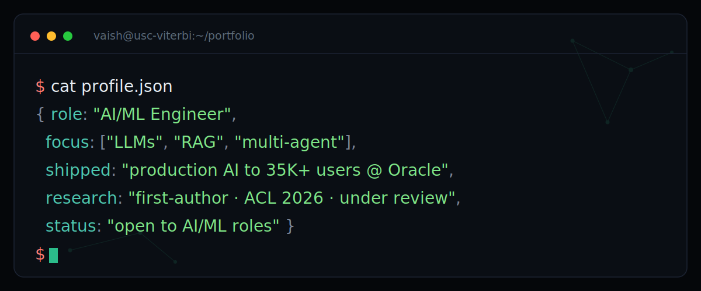

<!-- ════════════════════════════════════════════════════════════════
     HERO — terminal card (commit profile-card.svg to repo root)
     ════════════════════════════════════════════════════════════════ -->
<div align="center">



<br><br>

[](https://www.linkedin.com/in/vaishnavi-srinivas-65bb01240/)
[](https://vaiishh.github.io/Portfolio/)
[](mailto:YOUR_EMAIL@usc.edu)

</div>

<br>

<!-- ════════════════════════════════════════════════════════════════
     ~/about
     ════════════════════════════════════════════════════════════════ -->
## `~/about`

I sit at an intersection most candidates don't: I **ship production AI**, I **publish the research** behind it, and I'm comfortable all the way down to **CUDA kernels**. Most people do one of those three.

- 🏭 &nbsp;**Production, at scale** — multi-agent pipelines, RAG systems, and agentic frameworks at **Oracle**, used across **35,000+ users**.
- 📄 &nbsp;**Research that holds up** — **first-author paper under review at ACL 2026** on reward-constrained multi-agent reasoning, plus **2× IEEE** publications.
- 🤖 &nbsp;**Agentic systems depth** — currently a **Research Assistant** building and evaluating multi-agent LLM systems.
- 🚀 &nbsp;**End-to-end, not just notebooks** — my projects go model → API → deployed product with **real users**.

> `🎓 MS Computer Science (AI) @ USC Viterbi` &nbsp;·&nbsp; `📍 Los Angeles` &nbsp;·&nbsp; `💬 Open to AI/ML roles`

<br>

<!-- ════════════════════════════════════════════════════════════════
     ~/impact  (resume metrics — no commit history needed)
     ════════════════════════════════════════════════════════════════ -->
## `~/impact`

<div align="center">


</div>

<br>

<!-- ════════════════════════════════════════════════════════════════
     ~/experience
     ════════════════════════════════════════════════════════════════ -->
## `~/experience`

```bash
$ git log --author="vaish" --oneline --graph
* USC Viterbi   Research Assistant   multi-agent LLM systems · ACL 2026 · 1K+ users
* Oracle        AI/ML Engineer       agentic pipelines · RAG · $2M+ · 35K+ users
* Technodysis   RPA Developer        Power Automate · back-office automation
```

🔬 &nbsp;**Research Assistant** — *University of Southern California* · `Present`
> Building and evaluating multi-agent LLM systems — pipelines, backends, and evaluation frameworks supporting **1,000+ users**. Feeds directly into my ACL 2026 submission.

☁️ &nbsp;**AI/ML Engineer** — *Oracle*
> Architected multi-agent pipelines, RAG systems, and reusable agentic frameworks — part of an initiative recovering **$2M+ across 35,000+ users**. Drove ML workstreams that lifted efficiency **25% across 47 business units**, shipped to **6 global regions**. *OCI + AI Foundations certified.*

🤖 &nbsp;**RPA Developer** — *Technodysis*
> Automated bank-transaction verification and HR onboarding with Power Automate, removing manual effort from high-volume back-office processes.

<br>

<!-- ════════════════════════════════════════════════════════════════
     ~/projects
     ════════════════════════════════════════════════════════════════ -->
## `~/projects`

<table>
<tr>
<td width="50%" valign="top">

#### 🐝 [SQLSwarm](https://github.com/Vaiishh/sqlSwarm)
A swarm of LLM agents that profiles, rewrites & validates SQL for **Postgres / Snowflake** — query tuning without a senior DBA.


</td>
<td width="50%" valign="top">

#### 🔍 AgentForensics
Root-cause attribution for multi-agent LLM failures — *which agent and which decision actually broke the pipeline?*


</td>
</tr>
<tr>
<td width="50%" valign="top">

#### 💸 FinMind
Full-stack AI financial assistant **serving live users**, powered by **LLaMA 3.3 70B** on Groq.


</td>
<td width="50%" valign="top">

#### ⚖️ LegalMind
Multi-agent RAG research assistant for case law — retrieves, reasons across documents, answers **with citations**.


</td>
</tr>
<tr>
<td width="50%" valign="top">

#### 📚 [multisource_rag](https://github.com/Vaiishh/multisource_rag)
RAG over **conflicting** sources that flags contradictions instead of averaging them away. **8/10 top-1**, all seeded conflicts caught.


</td>
<td width="50%" valign="top">

#### ⚡ CUDAForge
Hand-optimized **CUDA kernels** benchmarked against cuBLAS — performance engineering at the GPU kernel level.


</td>
</tr>
</table>

<div align="center">

[](https://github.com/Vaiishh?tab=repositories)

</div>

<br>

<!-- ════════════════════════════════════════════════════════════════
     ~/stack
     ════════════════════════════════════════════════════════════════ -->
## `~/stack`

<div align="center">


</div>

<br>

**🧠 LLM / Machine Learning**
<br>


**⚙️ Backend & Infrastructure**
<br>


**🎨 Frontend**
<br>


**🔧 Tools & Practices**
<br>


<br>

<!-- ════════════════════════════════════════════════════════════════
     ~/credentials
     ════════════════════════════════════════════════════════════════ -->
## `~/credentials`

<table>
<tr>
<td width="50%" valign="top">

**📝 Publications**
- *Reward-constrained multi-agent LLM reasoning* — **first author**, under review at **ACL 2026**
- 2× **IEEE** publications

**🎓 Education**
- **M.S. Computer Science (AI)** — USC Viterbi
- GPA **3.5 / 4.0** · Graduating **May 2027**

</td>
<td width="50%" valign="top">

**📜 Certifications**
- Oracle Cloud Infrastructure (OCI)
- Oracle AI Foundations

**🌟 Beyond Code**
- 💰 **Deputy Director of Finance**, AIS @ USC
- 🚀 Member, **TiE** Hub @ USC

</td>
</tr>
</table>

<br>

<!-- ════════════════════════════════════════════════════════════════
     FOOTER
     ════════════════════════════════════════════════════════════════ -->
<div align="center">

```bash
$ echo "Let's build something." && exit 0
```

[](https://www.linkedin.com/in/vaishnavi-srinivas-65bb01240/)
[](https://vaiishh.github.io/Portfolio/)
[](mailto:YOUR_EMAIL@usc.edu)

</div>

<!-- ════════════════════════════════════════════════════════════════
     SETUP (delete before committing)
     ════════════════════════════════════════════════════════════════
     1. Commit profile-card.svg to the ROOT of your Vaiishh/Vaiishh repo
        (same folder as README.md). The hero  pulls it.
        To edit the card text, open the .svg and change the <tspan> strings.
     2. Replace YOUR_EMAIL@usc.edu (3 places) with a real address, or delete the badges.
     3. ALL commit-history widgets (stats, streak, trophies, activity graph) are GONE —
        nothing here depends on your contribution count.
     4. Double-check the ~/impact figures are ones you're happy to show publicly.
     5. Palette matches your portfolio: bg #0A0E14, teal #2BBC8A, green #7EE787,
        coral #FF7B72. Change these in the .svg + badge URLs to retheme.
     ════════════════════════════════════════════════════════════════ -->
